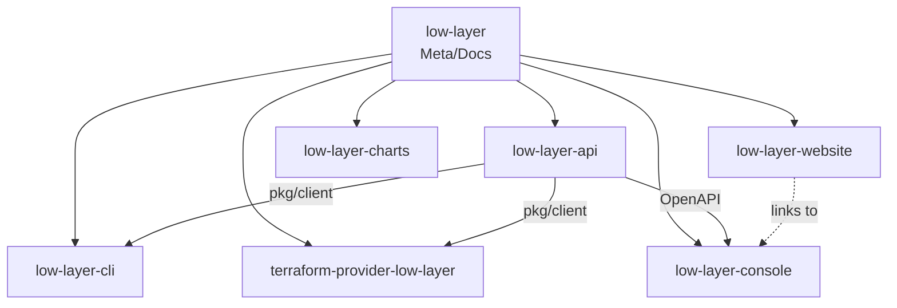

# LOW-LAYER Multi-Repository Structure

LOW-LAYER is composed of multiple repositories, each with a specific responsibility.
This document describes the codebase organization.

---

## Repository Overview

```
LOW-LAYER Platform
│
├── low-layer (this repo)           # Meta, docs, standards
│
├── low-layer-api                    # Core API (Go)
│
├── low-layer-cli                    # CLI tool (Go)
│
├── low-layer-website                # Public website (landing, legal)
│
├── low-layer-console                # Web console - authenticated (TypeScript/React)
│
├── terraform-provider-low-layer    # Terraform provider (Go)
│
└── low-layer-charts                 # Helm charts
```

---

## Web Applications

LOW-LAYER has **two distinct web applications**:

| Application | Repository | URL | Purpose |
|-------------|------------|-----|---------|
| **Public Website** | `low-layer-website` | low-layer.com | Landing page, pricing, legal pages |
| **Console** | `low-layer-console` | cloud.low-layer.com | Authenticated dashboard, orchestration |

---

## 1. low-layer (Meta Repository)

**Purpose**: Central hub for documentation, standards, and cross-repo coordination.

```
low-layer/
├── LICENSE                    # LOW-LAYER Source Available License
├── CLAUDE.md                  # AI coding standards
├── ARCHITECTURE.md            # This file
├── CHANGELOG.md               # Platform-wide changelog
├── README.md                  # Platform overview
│
├── docs/
│   ├── getting-started.md     # Quick start guide
│   ├── concepts/              # Core concepts
│   │   ├── organizations.md
│   │   ├── scopes.md
│   │   └── nodes.md
│   ├── api/                   # API reference
│   └── security/              # Security documentation
│
├── specs/                     # OpenAPI, Proto definitions
│   ├── openapi.yaml
│   └── proto/
│
└── branding/                  # Logos, assets
    ├── logo.svg
    └── colors.md
```

---

## 2. low-layer-api

**Purpose**: Core backend API for infrastructure provisioning and management.

**Language**: Go 1.22+

**Key Features**:
- REST + gRPC APIs
- Organization & Scope management
- Node provisioning orchestration
- OpenStack integration
- Kubernetes cluster management

```
low-layer-api/
├── cmd/
│   └── api/
│       └── main.go            # Entry point
│
├── internal/
│   ├── config/                # Configuration management
│   ├── api/
│   │   ├── rest/              # REST handlers (Echo/Fiber)
│   │   └── grpc/              # gRPC services
│   │
│   ├── domain/                # Business logic
│   │   ├── organization/
│   │   ├── scope/
│   │   ├── node/
│   │   └── cluster/
│   │
│   ├── infrastructure/        # External integrations
│   │   ├── openstack/         # OpenStack client
│   │   ├── kubernetes/        # K8s client
│   │   └── openbao/           # OpenBao client
│   │
│   └── repository/            # Data access layer
│       ├── postgres/
│       └── redis/
│
├── pkg/                       # Public packages (shared with CLI)
│   ├── client/                # API client SDK
│   └── models/                # Shared models
│
├── migrations/                # Database migrations
├── api/                       # OpenAPI specs
├── Dockerfile
├── Makefile
└── go.mod
```

**Tech Stack**:
| Component | Technology |
|-----------|------------|
| HTTP Framework | Echo or Fiber |
| gRPC | google.golang.org/grpc |
| Database | PostgreSQL + sqlc/pgx |
| Cache | Redis |
| Config | Viper |
| Logging | Zap |
| Metrics | Prometheus |
| Tracing | OpenTelemetry |

---

## 3. low-layer-cli

**Purpose**: Command-line interface for developers and operators.

**Language**: Go 1.22+

```
low-layer-cli/
├── cmd/
│   └── lowlayer/
│       └── main.go
│
├── internal/
│   ├── commands/              # CLI commands
│   │   ├── org/               # lowlayer org create/list/delete
│   │   ├── scope/             # lowlayer scope create/list/delete
│   │   ├── node/              # lowlayer node provision/status
│   │   ├── cluster/           # lowlayer cluster kubeconfig
│   │   └── auth/              # lowlayer login/logout
│   │
│   ├── config/                # CLI configuration (~/.lowlayer/)
│   ├── output/                # Formatters (table, json, yaml)
│   └── client/                # API client wrapper
│
├── Makefile
├── goreleaser.yaml            # Multi-platform builds
└── go.mod
```

**Commands Structure**:
```bash
lowlayer login                           # Authenticate
lowlayer org create <name>               # Create organization
lowlayer org list                        # List organizations
lowlayer scope create <org> <name>       # Create scope
lowlayer node provision <scope> --count 3
lowlayer cluster kubeconfig <scope>      # Get kubeconfig
lowlayer catalog list                    # List available services
lowlayer catalog deploy postgres <scope> # Deploy service
```

---

## 4. low-layer-website

**Purpose**: Public-facing website with landing page, pricing, and legal pages.

**Language**: TypeScript

**Framework**: Astro (static site generation) or Next.js

**URL**: https://low-layer.com

```
low-layer-website/
├── src/
│   ├── pages/
│   │   ├── index.astro            # Landing page (hero, features, pricing)
│   │   ├── pricing.astro          # Detailed pricing page
│   │   ├── contact.astro          # Contact form
│   │   │
│   │   └── legal/                 # Legal pages (shared across all sites)
│   │       ├── cgu.astro          # Conditions Générales d'Utilisation
│   │       ├── cgv.astro          # Conditions Générales de Vente
│   │       ├── privacy.astro      # Politique de confidentialité
│   │       └── mentions.astro     # Mentions légales
│   │
│   ├── components/
│   │   ├── layout/
│   │   │   ├── Header.astro       # Navigation
│   │   │   ├── Footer.astro       # Footer with legal links
│   │   │   └── Layout.astro       # Base layout
│   │   │
│   │   ├── sections/              # Landing page sections
│   │   │   ├── Hero.astro
│   │   │   ├── Features.astro
│   │   │   ├── Security.astro
│   │   │   ├── Automation.astro
│   │   │   ├── Console.astro      # Interactive demo
│   │   │   ├── Stack.astro
│   │   │   ├── Pricing.astro
│   │   │   └── FAQ.astro
│   │   │
│   │   └── ui/                    # Reusable UI components
│   │       ├── Button.astro
│   │       ├── Card.astro
│   │       └── Badge.astro
│   │
│   ├── content/
│   │   └── legal/                 # Legal content (Markdown)
│   │       ├── cgu.md
│   │       ├── cgv.md
│   │       ├── privacy.md
│   │       └── mentions.md
│   │
│   ├── styles/
│   │   └── global.css             # Tailwind + custom styles
│   │
│   └── lib/
│       └── constants.ts           # Company info, links
│
├── public/
│   ├── favicon.ico
│   ├── logo.svg
│   └── og-image.png               # Social sharing image
│
├── astro.config.mjs
├── tailwind.config.js
├── package.json
└── Dockerfile
```

**Legal Pages (Required for French SAS)**:

| Page | Route | Description |
|------|-------|-------------|
| CGU | `/legal/cgu` | Conditions Générales d'Utilisation |
| CGV | `/legal/cgv` | Conditions Générales de Vente |
| Privacy | `/legal/privacy` | Politique de confidentialité (RGPD) |
| Mentions | `/legal/mentions` | Mentions légales (SIRET, hébergeur, etc.) |

**Tech Stack**:
| Component | Technology |
|-----------|------------|
| Framework | Astro 4.x |
| Styling | Tailwind CSS |
| Deployment | Vercel / Cloudflare Pages |
| Analytics | Plausible (RGPD compliant) |
| Forms | Formspree or custom API |

---

## 5. low-layer-console

**Purpose**: Authenticated web console for infrastructure management.

**Language**: TypeScript

**Framework**: React + Vite

**URL**: https://cloud.low-layer.com

```
low-layer-console/
├── src/
│   ├── main.tsx
│   ├── App.tsx
│   │
│   ├── components/
│   │   ├── ui/                # Design system (shadcn/ui)
│   │   ├── layout/            # Navigation, sidebar
│   │   ├── graph/             # Visual editor (React Flow)
│   │   └── forms/             # Service configuration forms
│   │
│   ├── pages/
│   │   ├── dashboard/
│   │   ├── organizations/
│   │   ├── scopes/
│   │   ├── nodes/
│   │   ├── catalog/
│   │   └── settings/
│   │
│   ├── hooks/                 # React Query hooks
│   ├── api/                   # API client (generated from OpenAPI)
│   ├── stores/                # Zustand stores
│   └── lib/                   # Utilities
│
├── public/
├── index.html
├── tailwind.config.js
├── vite.config.ts
└── package.json
```

**Tech Stack**:
| Component | Technology |
|-----------|------------|
| Framework | React 18 |
| Build | Vite |
| Styling | Tailwind CSS |
| Components | shadcn/ui |
| State | Zustand |
| Data Fetching | TanStack Query |
| Graph Editor | React Flow |
| Forms | React Hook Form + Zod |
| Auth | Keycloak OIDC |

---

## 6. terraform-provider-low-layer

**Purpose**: Terraform provider for Infrastructure as Code.

**Language**: Go 1.22+

**Framework**: Terraform Plugin Framework

```
terraform-provider-low-layer/
├── internal/
│   ├── provider/
│   │   └── provider.go        # Provider configuration
│   │
│   └── resources/
│       ├── organization.go    # lowlayer_organization
│       ├── scope.go           # lowlayer_scope
│       ├── node.go            # lowlayer_node
│       ├── cluster.go         # lowlayer_cluster
│       └── catalog_service.go # lowlayer_catalog_service
│
├── examples/
│   ├── provider/
│   └── resources/
│
├── docs/                      # Generated documentation
├── main.go
├── Makefile
└── go.mod
```

**Resources**:
```hcl
# Organization
resource "lowlayer_organization" "prod" {
  name        = "acme-production"
  mode        = "dedicated"  # or "shared"
  region      = "fr-par-1"
}

# Scope (Environment)
resource "lowlayer_scope" "prod_main" {
  organization_id = lowlayer_organization.prod.id
  name            = "main"
}

# Node provisioning
resource "lowlayer_node" "workers" {
  scope_id = lowlayer_scope.prod_main.id
  count    = 3
  flavor   = "m1.large"
  role     = "worker"
}

# Catalog service
resource "lowlayer_catalog_service" "postgres" {
  scope_id = lowlayer_scope.prod_main.id
  type     = "postgres"
  version  = "15"

  config = {
    replicas = 2
    storage  = "50Gi"
  }
}
```

---

## 7. low-layer-charts

**Purpose**: Helm charts for deploying LOW-LAYER components and catalog services.

```
low-layer-charts/
├── charts/
│   ├── low-layer-api/
│   │   ├── Chart.yaml
│   │   ├── values.yaml
│   │   └── templates/
│   │
│   ├── low-layer-console/
│   │
│   └── catalog/
│       ├── postgres/
│       ├── keycloak/
│       ├── openbao/
│       ├── redis/
│       └── rabbitmq/
│
└── README.md
```

---

## Inter-Repository Dependencies



---

## Shared Components

### API Client SDK (`low-layer-api/pkg/client`)

Shared Go client used by:
- `low-layer-cli`
- `terraform-provider-low-layer`

```go
import "github.com/low-layer/low-layer-api/pkg/client"

client := client.New(
    client.WithEndpoint("https://api.low-layer.com"),
    client.WithToken(token),
)

org, err := client.Organizations.Create(ctx, &client.CreateOrganizationInput{
    Name: "my-org",
    Mode: client.ModeDedicated,
})
```

### Proto/OpenAPI Specs (`low-layer/specs`)

Central location for API contracts:
- OpenAPI 3.1 specification
- Protocol Buffers definitions
- Generated from this repo, consumed by others

### Legal Pages (`low-layer-website/src/content/legal/`)

Legal content is hosted in `low-layer-website` and linked from:
- `low-layer-website` (footer)
- `low-layer-console` (footer links to website)

---

## Versioning Strategy

All repositories follow [Semantic Versioning](https://semver.org/).

| Repository | Version Prefix | Example |
|------------|----------------|---------|
| low-layer-api | `v` | `v1.2.0` |
| low-layer-cli | `v` | `v1.2.0` |
| low-layer-website | `v` | `v1.2.0` |
| low-layer-console | `v` | `v1.2.0` |
| terraform-provider-low-layer | `v` | `v1.2.0` |
| low-layer-charts | Chart version | `1.2.0` |

**Compatibility Matrix**: Maintained in this repo (`docs/compatibility.md`).

---

## Development Workflow

1. **Specs First**: Update OpenAPI/Proto in `low-layer/specs`
2. **API Implementation**: Implement in `low-layer-api`
3. **Client Generation**: Update SDK in `low-layer-api/pkg/client`
4. **CLI/Provider/Console**: Consume new API features
5. **Documentation**: Update docs in `low-layer/docs`

---

## CI/CD Pipeline

Each repo has its own pipeline:

| Repo | CI | Artifacts |
|------|----|-----------|
| low-layer-api | GitHub Actions | Docker image → GHCR |
| low-layer-cli | GitHub Actions + GoReleaser | Binaries → GitHub Releases |
| low-layer-website | GitHub Actions | Vercel / Cloudflare Pages |
| low-layer-console | GitHub Actions | Docker image → GHCR |
| terraform-provider-low-layer | GitHub Actions | Terraform Registry |
| low-layer-charts | GitHub Actions | Helm repo → GitHub Pages |

---

## URLs & Domains

| Domain | Application | Purpose |
|--------|-------------|---------|
| `low-layer.com` | low-layer-website | Public website, landing |
| `cloud.low-layer.com` | low-layer-console | Authenticated console |
| `api.low-layer.com` | low-layer-api | REST/gRPC API |
| `doc.low-layer.com` | low-layer/docs | Documentation (Docusaurus) |

---

## Getting Started (For Contributors)

```bash
# Clone all repos
git clone https://github.com/low-layer/low-layer.git
git clone https://github.com/low-layer/low-layer-api.git
git clone https://github.com/low-layer/low-layer-cli.git
git clone https://github.com/low-layer/low-layer-website.git
git clone https://github.com/low-layer/low-layer-console.git
git clone https://github.com/low-layer/terraform-provider-low-layer.git

# Setup development environment
cd low-layer-api
make setup    # Install tools
make dev      # Run locally

# In another terminal
cd ../low-layer-console
npm install
npm run dev
```

---

## Contact

- **Technical**: tech@low-layer.com
- **Commercial**: contact@low-layer.com
- **Website**: https://low-layer.com
